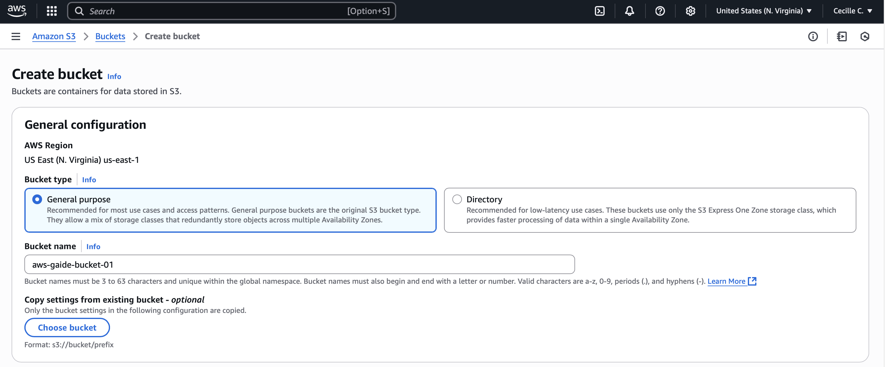
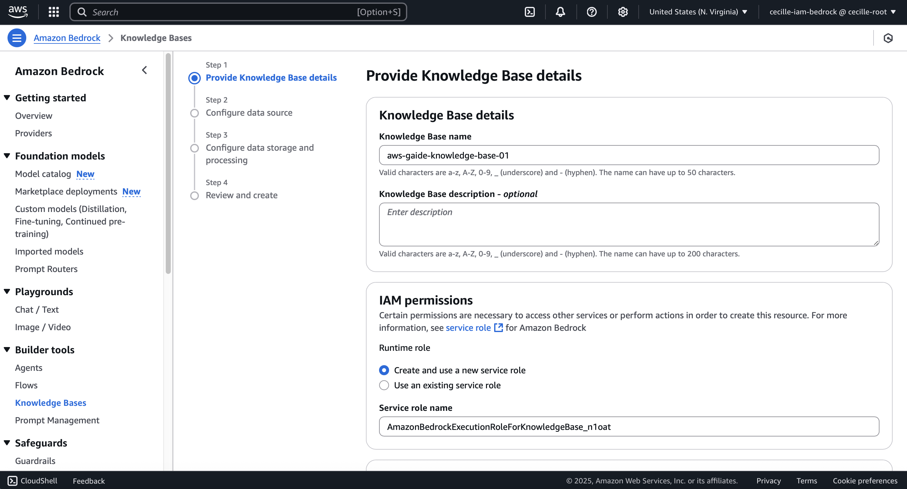
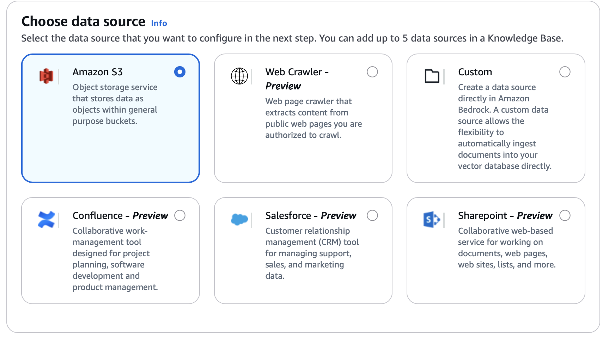
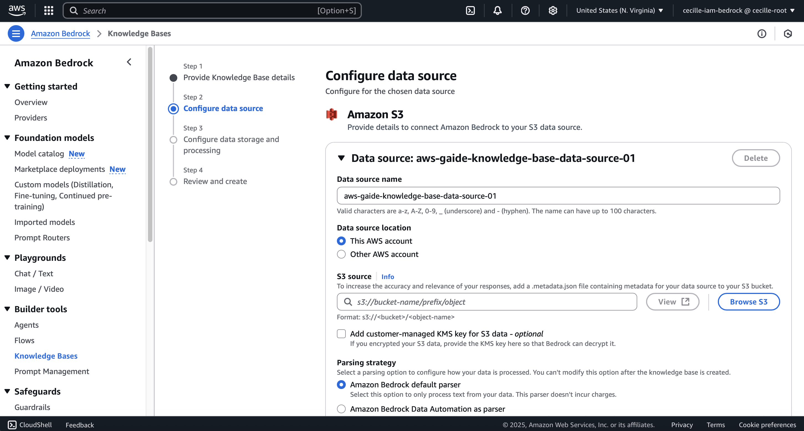
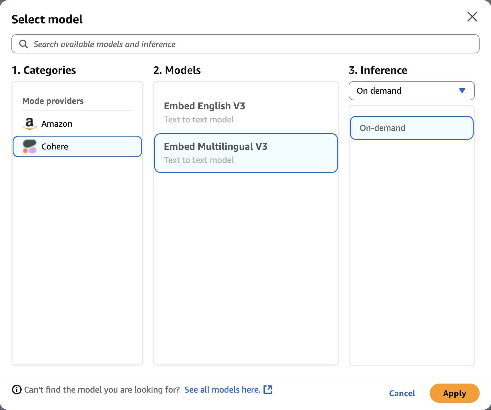
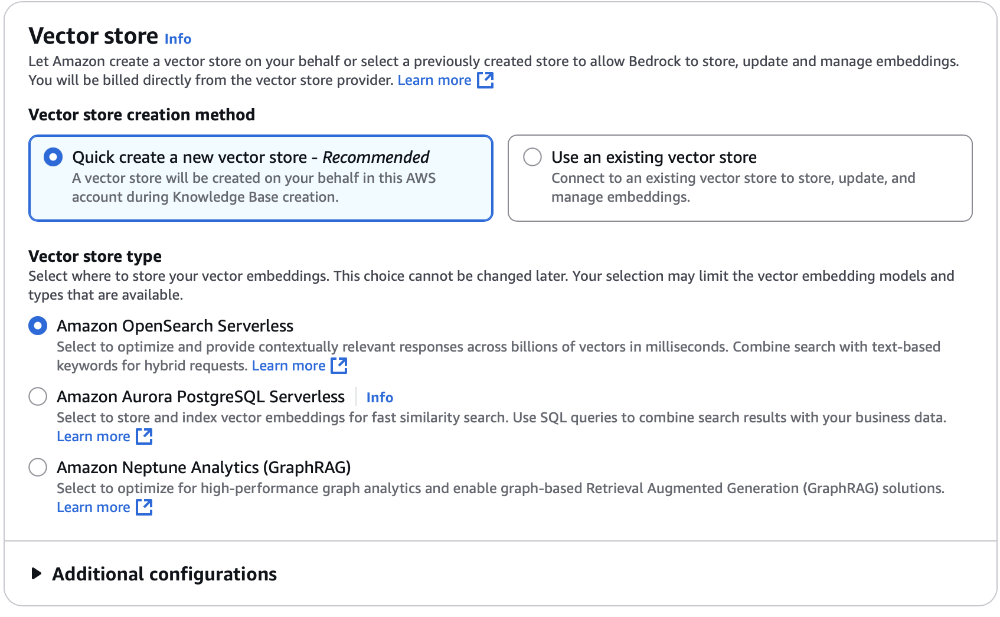

**🌊 GAIDE01: AI-Driven Compliance and Regulatory Reporting Platform**

#generativeai #datamodelling #python #amazonbedrock #compliance #regulatoryreporting

**Introduction**

Intelligent automation of business process operations has come to the force as a future-oriented function in the financial services industry, ultimately aimed at improving user experience, efficiency and precision. This hands-on and demo project will show how to implement a practical risk and compliance monitoring platform, assisted by generative AI, which may help a financial organisation to manage and mitigate risks, while ensuring adherence to regulatory requirements and internal policies.

**Specifications**

1. Build a robust suspicious transaction report (STR) generation platform.
2. The compliance framework is shaped up by using AWS generative AI foundation models (FMs) for STR drafts combined with knowledge bases (e.g., fraudulent activities) powered by vector databases to enhance prompt engineering and to be intelligently used by Amazon Bedrock agents.
3. Sample data consist of account information and transaction details.
4. The reports generated will be excel files.

**Technical Coverage**

**Accessing Foundation Models**

To access below required data models, please see the following resource: https://docs.aws.amazon.com/bedrock/latest/userguide/model-access-modify.html
1. Amazon Bedrock FM: Amazon Titan Text Embeddings V2
2. Amazon Bedrock FM: Anthropic Claude 3 Haiku

**Setting up an Amazon S3 Bucket**

This new Amazon S3 bucket will serve as document repository and data source of a new Amazon Bedrock knowledge base, which will also be created later. To create an S3 bucket, please see the following resource: https://docs.aws.amazon.com/AmazonS3/latest/userguide/creating-bucket.html

Fill in a bucket name for the S3 bucket to be created.

**Setting up an Amazon Bedrock Knowledge Base**

To create a Bedrock knowledge base, the previously created S3 bucket or data source will be connected to it. Please see the following resource to set up a knowledge base: https://docs.aws.amazon.com/bedrock/latest/userguide/knowledge-base-create.html

Fill in a name for the knowledge base to be created and keep the automatically generated Service role name.

Select Amazon S3 as the data source of fraudulent entities and the knowledge base will use OpenSearch Serverless to index fraudulent entity data.

Next is to configure the data source by providing a Data source name.

For Embeddings Model, select Cohere Embed Multilingual V3 and apply.

Under Vector store configurations, select Quick create a new vector store for the Vector store creation method, and then select Amazon OpenSearch Serverless for the Vector store type.

